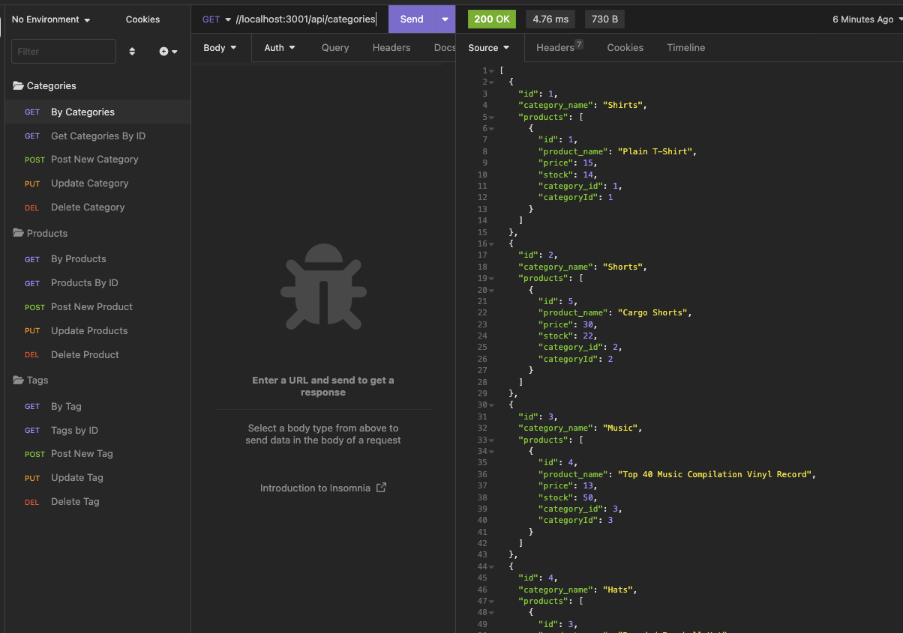
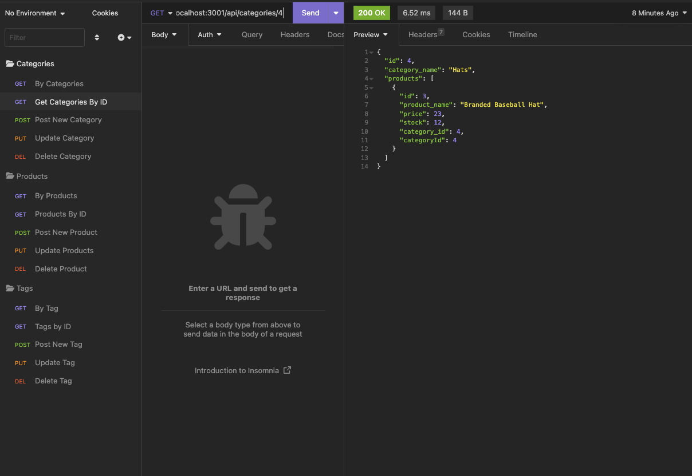

# 13 Object-Relational Mapping (ORM): E-Commerce Back End

This application is a back end application using a MySql database to track objects in an ecommerce store. 
The information can be seen in Insomnia as fetched through GET requests, added through POST requests, updated through PUT requests, and deleted through DELETE requests. 

This application runs only on the backend.

Here are screenshots of the fetched information in Insomnia.

Here is a link to the video of the completed application.
https://drive.google.com/file/d/19JjnDCJeVyv26XIwUhlqErq95ts9jQ07/view